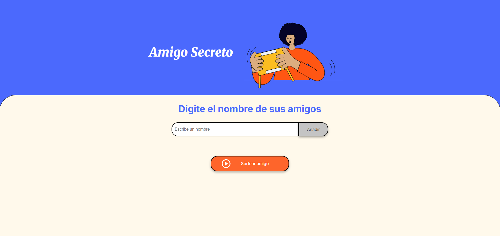

# 🎁 Amigo Secreto


Una aplicación web simple y divertida para organizar sorteos de amigo secreto. Ingresás nombres, hacés clic en **"Sortear"** y listo.

## 🧠 Objetivo

Este proyecto fue creado como un ejercicio para fortalecer la lógica de programación y la manipulación del DOM usando JavaScript, HTML y CSS puros.

---

## 🌐 Demo en línea

👉 **[Ver en vivo](https://Monter89.github.io/amigo-secreto/)** 👈

---

## ✨ Funcionalidades

- 🧑‍🤝‍🧑 Añadir nombres de amigos/as
- 🎲 Sortear aleatoriamente un amigo secreto
- 🧹 Interfaz simple, clara y responsive
- ⚡ Instantáneo, sin recarga ni base de datos

---

## 🛠️ Tecnologías utilizadas

- **HTML5**
- **CSS3**
- **JavaScript Vanilla**

---

## 📂 Estructura del proyecto

```
├── index.html              # Página principal
├── style.css               # Estilos del sitio
├── app.js                  # Lógica del sorteo
├── assets/
│   ├── amigo-secreto.png   # Imagen principal
│   └── play_circle_outline.png # Icono de botón
```

---

## 🧰 Herramientas de desarrollo

- [Visual Studio Code](https://code.visualstudio.com/)
- [Git](https://git-scm.com/)
- [GitHub](https://github.com/)
- [GitHub Pages](https://pages.github.com/)

---

## 📸 Captura de pantalla



---

## 👨‍💻 Autor

**[@Monter89](https://github.com/Monter89)**

---

## 📄 Licencia

Este proyecto está bajo la licencia MIT.  
Usalo, modificalo y compartilo libremente 🚀

---

> Hecho con ❤️ y JavaScript.
